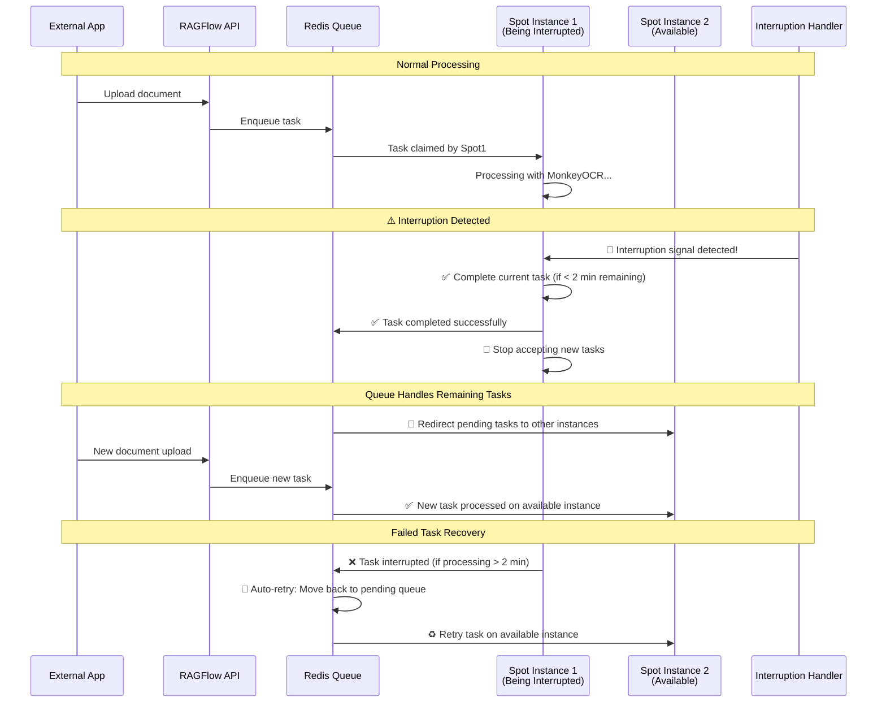
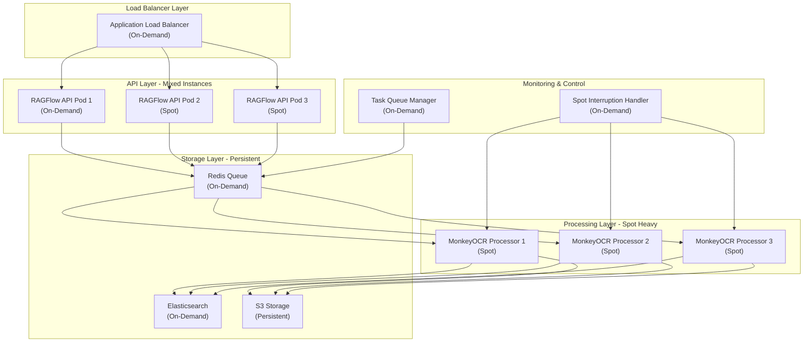

# EKS Spot Instance Deployment Strategy for RAGFlow + MonkeyOCR

## 🎯 **Overview**

Deploying RAGFlow with MonkeyOCR on EKS spot instances provides significant cost savings (up to 90%) but requires robust interruption handling strategies.

---

## 🚨 **Spot Instance Interruption Challenges**

### **Key Issues**
- **2-minute warning**: AWS provides only 2 minutes before termination
- **Model loading time**: MonkeyOCR models can take 2-5 seconds to load
- **Processing interruption**: Long-running OCR tasks may be interrupted
- **Memory state loss**: In-memory data is lost during interruption

### **RAGFlow + MonkeyOCR Advantages**
✅ **Load-Process-Unload cycle**: Perfect for spot instances
✅ **Stateless processing**: Each task is independent
✅ **Task-based architecture**: Easy to retry interrupted jobs
✅ **No persistent model state**: Models are loaded per-task
✅ **Queue-and-retry strategy**: Tasks automatically requeued when interrupted

---

## 🔄 **Task Flow During Spot Instance Interruption**

### **What Happens When Interruption is Detected:**



### **Task States During Interruption:**

1. **📝 Pending Tasks**: Automatically picked up by other available instances
2. **⚡ Currently Processing**:
   - ✅ **Short tasks** (< 2 min): Complete successfully
   - 🔄 **Long tasks** (> 2 min): Automatically requeued for retry
3. **🆕 New Tasks**: Routed to available instances (no interruption)

### **Automatic Recovery Process:**

| Scenario | Action | Result |
|----------|---------|---------|
| **Task in Queue** | 📤 Redirect to available instance | ✅ Processed normally |
| **Task Processing < 2min** | ⏱️ Allow completion | ✅ Completed successfully |
| **Task Processing > 2min** | 🔄 Auto-requeue with retry count | ♻️ Retried on available instance |
| **Failed Task** | 🔄 Retry up to 3 times | ♻️ Eventual success or manual review |

---

## 🏗️ **Architecture for Spot Instance Resilience**

### **Multi-Tier Architecture**



---

## ⚙️ **Implementation Strategy**

### **1. Node Group Configuration**

#### **Mixed Instance Types**
```yaml
# eks-nodegroup-config.yaml
apiVersion: eksctl.io/v1alpha5
kind: ClusterConfig

metadata:
  name: ragflow-cluster
  region: us-west-2

nodeGroups:
  # Critical services - On-Demand
  - name: critical-services
    instanceTypes:
      - m5.large
      - m5.xlarge
    minSize: 2
    maxSize: 5
    desiredCapacity: 2
    spot: false
    labels:
      node-type: "critical"
      workload: "api-storage"
    taints:
      - key: "critical-only"
        value: "true"
        effect: NoSchedule

  # Processing services - Spot Instances
  - name: processing-spot
    instanceTypes:
      - g4dn.xlarge   # GPU for MonkeyOCR
      - g4dn.2xlarge
      - g4dn.4xlarge
    minSize: 1
    maxSize: 10
    desiredCapacity: 3
    spot: true
    spotInstancePools: 3
    labels:
      node-type: "spot"
      workload: "processing"
    taints:
      - key: "spot-instance"
        value: "true"
        effect: NoSchedule
```

### **2. Spot Interruption Handler**

#### **AWS Node Termination Handler**
```bash
# Install AWS Node Termination Handler
kubectl apply -f https://github.com/aws/aws-node-termination-handler/releases/download/v1.19.0/all-resources.yaml
```

#### **Custom Interruption Handler**
```yaml
# spot-interruption-handler.yaml
apiVersion: apps/v1
kind: DaemonSet
metadata:
  name: spot-interruption-handler
spec:
  selector:
    matchLabels:
      app: spot-interruption-handler
  template:
    spec:
      nodeSelector:
        node-type: "spot"
      tolerations:
        - key: "spot-instance"
          effect: NoSchedule
      containers:
      - name: handler
        image: ragflow/spot-handler:latest
        env:
        - name: WEBHOOK_URL
          value: "http://ragflow-api:8080/api/v1/spot-interruption"
        volumeMounts:
        - name: proc
          mountPath: /proc
          readOnly: true
        - name: sys
          mountPath: /sys
          readOnly: true
        command:
        - /bin/sh
        - -c
        - |
          while true; do
            # Check for spot interruption notice every 5 seconds
            if curl -f http://169.254.169.254/latest/meta-data/spot/instance-action 2>/dev/null; then
              echo "Spot interruption detected!"

              # Notify RAGFlow API
              curl -X POST $WEBHOOK_URL \
                -H "Content-Type: application/json" \
                -d "{\"node\": \"$NODE_NAME\", \"action\": \"drain\"}"

              # Wait for graceful shutdown
              sleep 110
            fi
            sleep 5  # 🔄 AUTOMATIC 5-SECOND POLLING INTERVAL
          done
      volumes:
      - name: proc
        hostPath:
          path: /proc
      - name: sys
        hostPath:
          path: /sys
```

### **3. Graceful Task Handling**

#### **Enhanced MonkeyOCR Parser with Interruption Handling**
```python
# rag/app/monkey_ocr_parser.py (Enhanced)
import signal
import threading
import time
from contextlib import contextmanager

class GracefulInterruptHandler:
    """Handle graceful interruption during MonkeyOCR processing."""

    def __init__(self):
        self.interrupted = False
        self.processing = False
        signal.signal(signal.SIGTERM, self._signal_handler)
        signal.signal(signal.SIGINT, self._signal_handler)

    def _signal_handler(self, signum, frame):
        """Handle interruption signals."""
        self.interrupted = True
        if self.processing:
            logger.warning("Interruption received during processing. Finishing current task...")

    @contextmanager
    def processing_context(self):
        """Context manager for processing state."""
        self.processing = True
        try:
            yield self
        finally:
            self.processing = False

# Global interruption handler
interruption_handler = GracefulInterruptHandler()

def chunk(filename, binary=None, from_page=0, to_page=100000,
          lang="Chinese", callback=None, **kwargs):
    """
    Enhanced chunk function with interruption handling.
    """
    def safe_callback(progress, message):
        if callback:
            callback(progress, message)

    # Check if we're being interrupted before starting
    if interruption_handler.interrupted:
        logger.info("Skipping task due to interruption signal")
        return []

    safe_callback(0.1, "Initializing MonkeyOCR...")

    with interruption_handler.processing_context():
        # Check interruption before model loading
        if interruption_handler.interrupted:
            safe_callback(-1, "Task interrupted before processing")
            return []

        # Initialize MonkeyOCR
        monkey_ocr = MonkeyOCR()

        # Prepare document (same as before)
        # ... document preparation code ...

        try:
            # Check interruption before processing
            if interruption_handler.interrupted:
                safe_callback(-1, "Task interrupted during setup")
                return []

            safe_callback(0.2, "Processing document with MonkeyOCR...")

            # Process with MonkeyOCR
            config = kwargs.get("parser_config", {})
            result = monkey_ocr.get_markdown_result(temp_path, config)

            # Check interruption after processing
            if interruption_handler.interrupted:
                logger.warning("Interruption occurred during processing. Completing current task...")

            safe_callback(0.8, "Formatting results for knowledge base...")

            # Format results (same as before)
            # ... result formatting code ...

            if interruption_handler.interrupted:
                logger.info("Task completed despite interruption signal")

            return [doc] if result.get("markdown") else []

        except Exception as e:
            if interruption_handler.interrupted:
                safe_callback(-1, f"Task interrupted with error: {str(e)}")
            else:
                safe_callback(-1, f"MonkeyOCR processing failed: {str(e)}")
            return []
```

### **4. Task Queue Resilience**

#### **Redis Task Queue Configuration**
```yaml
# redis-ha.yaml
apiVersion: apps/v1
kind: StatefulSet
metadata:
  name: redis-ha
spec:
  replicas: 3
  selector:
    matchLabels:
      app: redis-ha
  template:
    spec:
      nodeSelector:
        node-type: "critical"
      tolerations:
        - key: "critical-only"
          effect: NoSchedule
      containers:
      - name: redis
        image: redis:7-alpine
        args:
        - redis-server
        - --appendonly yes
        - --cluster-enabled yes
        - --cluster-config-file nodes.conf
        - --cluster-node-timeout 5000
        ports:
        - containerPort: 6379
        volumeMounts:
        - name: redis-data
          mountPath: /data
        resources:
          requests:
            memory: "512Mi"
            cpu: "250m"
          limits:
            memory: "1Gi"
            cpu: "500m"
  volumeClaimTemplates:
  - metadata:
      name: redis-data
    spec:
      accessModes: ["ReadWriteOnce"]
      resources:
        requests:
          storage: 10Gi
```

#### **Task Queue Manager**
```python
# api/utils/task_queue_manager.py
import redis
import json
import logging
from datetime import datetime, timedelta

class ResilientTaskQueue:
    """Task queue with spot instance resilience."""

    def __init__(self, redis_url="redis://redis-ha:6379"):
        self.redis = redis.Redis.from_url(redis_url)
        self.processing_queue = "monkeyocr:processing"
        self.pending_queue = "monkeyocr:pending"
        self.failed_queue = "monkeyocr:failed"
        self.heartbeat_key = "monkeyocr:heartbeat"

    def enqueue_task(self, task_data):
        """Add task to pending queue."""
        task = {
            "id": task_data["id"],
            "filename": task_data["filename"],
            "binary": task_data.get("binary"),
            "config": task_data.get("config", {}),
            "created_at": datetime.utcnow().isoformat(),
            "retry_count": 0
        }
        self.redis.lpush(self.pending_queue, json.dumps(task))
        logging.info(f"Task {task['id']} enqueued")

    def claim_task(self, worker_id, timeout=300):
        """Claim a task for processing with timeout."""
        # Move task from pending to processing
        task_data = self.redis.brpoplpush(
            self.pending_queue,
            self.processing_queue,
            timeout=timeout
        )

        if task_data:
            task = json.loads(task_data)
            task["worker_id"] = worker_id
            task["claimed_at"] = datetime.utcnow().isoformat()

            # Update processing queue with worker info
            self.redis.lrem(self.processing_queue, 1, task_data)
            self.redis.lpush(self.processing_queue, json.dumps(task))

            # Set heartbeat
            self.set_heartbeat(worker_id, task["id"])

            return task
        return None

    def complete_task(self, task_id, worker_id):
        """Mark task as completed."""
        # Remove from processing queue
        processing_tasks = self.redis.lrange(self.processing_queue, 0, -1)
        for task_data in processing_tasks:
            task = json.loads(task_data)
            if task["id"] == task_id and task["worker_id"] == worker_id:
                self.redis.lrem(self.processing_queue, 1, task_data)
                break

        # Clear heartbeat
        self.redis.hdel(self.heartbeat_key, f"{worker_id}:{task_id}")
        logging.info(f"Task {task_id} completed by {worker_id}")

         def fail_task(self, task_id, worker_id, error_msg):
         """Handle task failure with retry logic during spot instance interruption."""
         processing_tasks = self.redis.lrange(self.processing_queue, 0, -1)
         for task_data in processing_tasks:
             task = json.loads(task_data)
             if task["id"] == task_id and task["worker_id"] == worker_id:
                 self.redis.lrem(self.processing_queue, 1, task_data)

                 task["retry_count"] += 1
                 task["last_error"] = error_msg
                 task["failed_at"] = datetime.utcnow().isoformat()

                 if task["retry_count"] < 3:
                     # 🔄 AUTOMATIC RETRY: Requeue for processing on available instances
                     del task["worker_id"]
                     del task["claimed_at"]
                     self.redis.lpush(self.pending_queue, json.dumps(task))
                     logging.info(f"Task {task_id} requeued for retry {task['retry_count']} (spot interruption)")
                 else:
                     # Move to failed queue after 3 attempts
                     self.redis.lpush(self.failed_queue, json.dumps(task))
                     logging.error(f"Task {task_id} failed permanently after 3 retries")
                 break

         self.redis.hdel(self.heartbeat_key, f"{worker_id}:{task_id}")

    def set_heartbeat(self, worker_id, task_id):
        """Set worker heartbeat."""
        self.redis.hset(
            self.heartbeat_key,
            f"{worker_id}:{task_id}",
            datetime.utcnow().isoformat()
        )

    def check_stale_tasks(self, stale_timeout=600):  # 10 minutes
        """Check for stale tasks and requeue them."""
        now = datetime.utcnow()
        stale_threshold = now - timedelta(seconds=stale_timeout)

        processing_tasks = self.redis.lrange(self.processing_queue, 0, -1)
        for task_data in processing_tasks:
            task = json.loads(task_data)
            claimed_at = datetime.fromisoformat(task.get("claimed_at", now.isoformat()))

            if claimed_at < stale_threshold:
                # Task is stale, requeue it
                self.redis.lrem(self.processing_queue, 1, task_data)

                # Remove worker info and requeue
                if "worker_id" in task:
                    del task["worker_id"]
                if "claimed_at" in task:
                    del task["claimed_at"]

                self.redis.lpush(self.pending_queue, json.dumps(task))
                logging.warning(f"Stale task {task['id']} requeued")
```

### **5. Pod Disruption Budget**

```yaml
# pod-disruption-budget.yaml
apiVersion: policy/v1
kind: PodDisruptionBudget
metadata:
  name: ragflow-api-pdb
spec:
  minAvailable: 1
  selector:
    matchLabels:
      app: ragflow-api
---
apiVersion: policy/v1
kind: PodDisruptionBudget
metadata:
  name: monkeyocr-processor-pdb
spec:
  maxUnavailable: 50%
  selector:
    matchLabels:
      app: monkeyocr-processor
```

### **6. Deployment Configurations**

#### **MonkeyOCR Processor Deployment**
```yaml
# monkeyocr-processor.yaml
apiVersion: apps/v1
kind: Deployment
metadata:
  name: monkeyocr-processor
spec:
  replicas: 3
  selector:
    matchLabels:
      app: monkeyocr-processor
  template:
    metadata:
      labels:
        app: monkeyocr-processor
    spec:
      nodeSelector:
        node-type: "spot"
      tolerations:
        - key: "spot-instance"
          effect: NoSchedule
      affinity:
        podAntiAffinity:
          preferredDuringSchedulingIgnoredDuringExecution:
          - weight: 100
            podAffinityTerm:
              labelSelector:
                matchLabels:
                  app: monkeyocr-processor
              topologyKey: kubernetes.io/hostname
      containers:
      - name: processor
        image: ragflow/monkeyocr-processor:latest
        env:
        - name: REDIS_URL
          value: "redis://redis-ha:6379"
        - name: WORKER_ID
          valueFrom:
            fieldRef:
              fieldPath: metadata.name
        - name: GRACEFUL_SHUTDOWN_TIMEOUT
          value: "120"
        resources:
          requests:
            memory: "4Gi"
            cpu: "1000m"
            nvidia.com/gpu: 1
          limits:
            memory: "8Gi"
            cpu: "2000m"
            nvidia.com/gpu: 1
        volumeMounts:
        - name: monkeyocr-models
          mountPath: /app/monkeyocr/models
          readOnly: true
        lifecycle:
          preStop:
            exec:
              command:
              - /bin/sh
              - -c
              - |
                echo "Received SIGTERM, gracefully shutting down..."
                # Signal the application to stop accepting new tasks
                touch /tmp/shutdown
                # Wait for current tasks to complete (max 2 minutes)
                sleep 120
        readinessProbe:
          exec:
            command:
            - /bin/sh
            - -c
            - "[ ! -f /tmp/shutdown ]"
          initialDelaySeconds: 5
          periodSeconds: 5
        livenessProbe:
          httpGet:
            path: /health
            port: 8080
          initialDelaySeconds: 30
          periodSeconds: 30
      volumes:
      - name: monkeyocr-models
        persistentVolumeClaim:
          claimName: monkeyocr-models-pvc
      terminationGracePeriodSeconds: 130
```

---

## 📊 **Monitoring & Alerting**

### **Custom Metrics**
```yaml
# monitoring-config.yaml
apiVersion: v1
kind: ConfigMap
metadata:
  name: monitoring-config
data:
  prometheus.yml: |
    global:
      scrape_interval: 15s

    scrape_configs:
    - job_name: 'ragflow-metrics'
      static_configs:
      - targets: ['ragflow-api:8080']
      metrics_path: /metrics

    - job_name: 'spot-interruption-metrics'
      static_configs:
      - targets: ['spot-interruption-handler:9090']

    rule_files:
    - "spot_alerts.yml"

  spot_alerts.yml: |
    groups:
    - name: spot_interruption_alerts
      rules:
      - alert: SpotInstanceInterruption
        expr: spot_interruption_detected == 1
        for: 0m
        labels:
          severity: warning
        annotations:
          summary: "Spot instance interruption detected"
          description: "Spot instance {{ $labels.instance }} is being interrupted"

      - alert: TaskQueueBacklog
        expr: redis_queue_length{queue="monkeyocr:pending"} > 100
        for: 5m
        labels:
          severity: warning
        annotations:
          summary: "High task queue backlog"
          description: "MonkeyOCR task queue has {{ $value }} pending tasks"
```

---

## 💰 **Cost Optimization**

### **Spot Instance Best Practices**
1. **Diversify Instance Types**: Use multiple instance families (g4dn, p3, etc.)
2. **Multi-AZ Deployment**: Spread across availability zones
3. **Mixed Capacity**: 20% on-demand, 80% spot for processing layer
4. **Auto Scaling**: Scale up during low-interruption periods

### **Expected Cost Savings**
- **Spot instances**: 60-90% cost reduction
- **Efficient scaling**: Only pay for active processing
- **Model loading optimization**: Minimal idle GPU time

---

## 🚀 **Deployment Commands**

```bash
# 1. Create EKS cluster with mixed instance types
eksctl create cluster -f eks-nodegroup-config.yaml

# 2. Install AWS Node Termination Handler
kubectl apply -f https://github.com/aws/aws-node-termination-handler/releases/download/v1.19.0/all-resources.yaml

# 3. Deploy Redis HA
kubectl apply -f redis-ha.yaml

# 4. Deploy interruption handler
kubectl apply -f spot-interruption-handler.yaml

# 5. Deploy RAGFlow with MonkeyOCR
kubectl apply -f monkeyocr-processor.yaml
kubectl apply -f pod-disruption-budget.yaml

# 6. Setup monitoring
kubectl apply -f monitoring-config.yaml
```

---

## ✅ **Testing Spot Interruption Handling**

```bash
# Simulate spot interruption
kubectl drain <node-name> --ignore-daemonsets --delete-emptydir-data

# Monitor task requeuing
kubectl logs -f deployment/monkeyocr-processor

# Check queue status
kubectl exec redis-ha-0 -- redis-cli llen monkeyocr:pending
kubectl exec redis-ha-0 -- redis-cli llen monkeyocr:processing
```

---

## ❓ **FAQ: Queue and Process Later Strategy**

### **Q: When interruption happens, do we queue tasks and process later?**

**A: Yes! Here's exactly what happens:**

1. **⚡ Interruption Detected** (2-minute warning)
   ```
   Spot Instance: "I'm being terminated in 2 minutes!"
   ```

2. **✅ Current Task Handling**
   - **Short tasks** (< 2 min): ✅ **Complete normally**
   - **Long tasks** (> 2 min): 🔄 **Auto-requeue for retry**

3. **📝 Pending Tasks in Queue**
   ```
   Redis Queue: "Redirect to available instances"
   Available Instances: "Pick up tasks immediately"
   ```

4. **🆕 New Incoming Tasks**
   ```
   External App → RAGFlow API → Redis Queue → Available Instance
   (No interruption, processed normally)
   ```

5. **🔄 Automatic Retry Logic**
   ```
   Failed Task → Retry Queue → Available Instance (up to 3 attempts)
   ```

### **Key Benefits:**
- ✅ **Zero data loss**: All tasks eventually processed
- ✅ **Automatic recovery**: No manual intervention needed
- ✅ **Seamless experience**: External apps see no interruption
- ✅ **Cost efficient**: 60-90% savings with spot instances

### **Real Example:**
```
12:00:00 - Task A, B, C in queue
12:00:05 - Spot Instance 1 claims Task A (2min processing time)
12:00:10 - Spot Instance 2 claims Task B (30sec processing time)
12:01:30 - ⚠️ Interruption detected on Instance 1
12:01:35 - Task B completes on Instance 2 ✅
12:02:00 - Task A interrupted on Instance 1 🔄
12:02:01 - Task A automatically requeued
12:02:02 - Instance 3 picks up Task A ♻️
12:02:32 - Task A completes successfully ✅
```

**Result: All tasks processed, zero manual intervention! 🎯**

---

This strategy ensures your RAGFlow + MonkeyOCR deployment can handle spot instance interruptions gracefully while maintaining cost efficiency! 🎯
