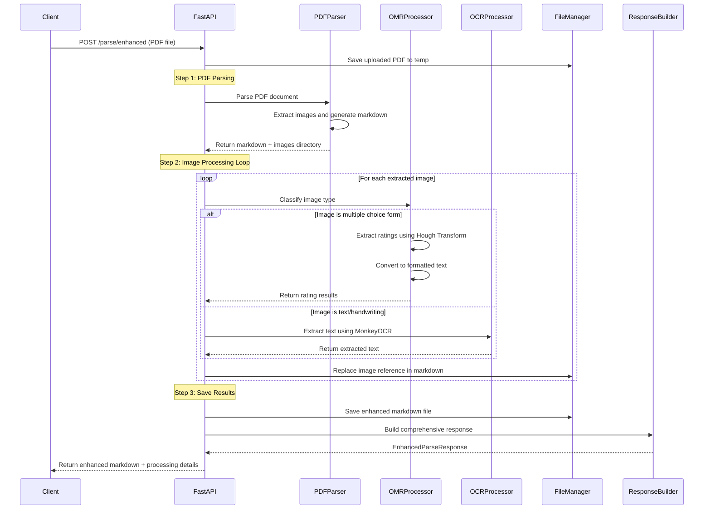
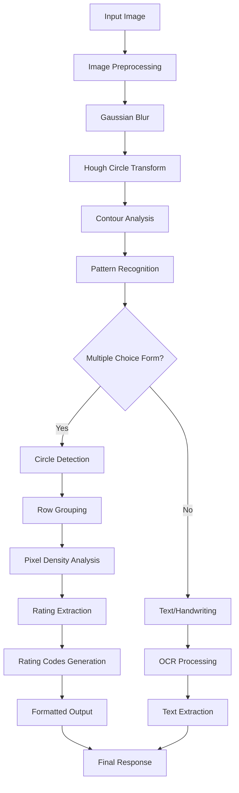

# Quick Start
## Locally Install
### 1. Install MonkeyOCR
See the [installation guide](https://github.com/Yuliang-Liu/MonkeyOCR/blob/main/docs/install_cuda.md#install-with-cuda-support) to set up your environment.
### 2. Download Model Weights
Download our quantized model from Huggingface.
```python
pip install huggingface_hub

python tools/download_model.py -t quantize  # MonkeyOCR with quantized
```

### 3. Inference
You can parse a file or a directory containing PDFs or images using the following commands:
```bash
# Replace input_path with the path to a PDF or image or directory

# End-to-end parsing
python parse.py input_path

# Parse files in a dir with specific group page num
python parse.py input_path -g 20

# Single-task recognition (outputs markdown only)
python parse.py input_path -t text/formula/table

# Parse PDFs in input_path and split results by pages
python parse.py input_path -s

# Specify output directory and model config file
python parse.py input_path -o ./output -c config.yaml
```

### 4. CEDD Enhanced Parsing
For enhanced parsing with OMR (Optical Mark Recognition) and OCR capabilities, use the CEDD parsing tool:

```bash
# Full end-to-end CEDD parsing (PDF → MonkeyOCR → classify images → OMR/OCR → enhanced .md)
python cedd_parse.py --input input.pdf --output ./output_cedd

# Parse only mode (extract images and generate initial markdown)
python cedd_parse.py --mode parse_only --input input.pdf --output ./output_cedd

# OCR only mode (process existing parsed folder with OMR/OCR)
python cedd_parse.py --mode ocr_only --parsed_folder ./output_cedd/document_name

# Custom configuration
python cedd_parse.py --input input.pdf --config custom_config.yaml --output ./custom_output
```

```

```
<details>
<summary><b>More usage examples</b></summary>

```bash
# Single file processing
python parse.py input.pdf                           # Parse single PDF file
python parse.py input.pdf -o ./output               # Parse with custom output dir
python parse.py input.pdf -s                        # Parse PDF with page splitting
python parse.py image.jpg                           # Parse single image file

# Single task recognition
python parse.py image.jpg -t text                   # Text recognition from image
python parse.py image.jpg -t formula                # Formula recognition from image
python parse.py image.jpg -t table                  # Table recognition from image
python parse.py document.pdf -t text                # Text recognition from all PDF pages

# Folder processing (all files individually)
python parse.py /path/to/folder                     # Parse all files in folder
python parse.py /path/to/folder -s                  # Parse with page splitting
python parse.py /path/to/folder -t text             # Single task recognition for all files

# Multi-file grouping (batch processing by page count)
python parse.py /path/to/folder -g 5                # Group files with max 5 total pages
python parse.py /path/to/folder -g 10 -s            # Group files with page splitting
python parse.py /path/to/folder -g 8 -t text        # Group files for single task recognition

# Advanced configurations
python parse.py input.pdf -c model_configs.yaml     # Custom model configuration
python parse.py /path/to/folder -g 15 -s -o ./out   # Group files, split pages, custom output
python parse.py input.pdf --pred-abandon            # Enable predicting abandon elements
```

</details>

<details>
<summary><b>CEDD parsing usage examples</b></summary>

```bash
# Basic CEDD parsing (full mode)
python cedd_parse.py --input document.pdf           # Full end-to-end processing
python cedd_parse.py --input document.pdf --output ./results  # Custom output directory

# Two-phase processing (useful for memory management)
python cedd_parse.py --mode parse_only --input document.pdf --output ./temp_output
python cedd_parse.py --mode ocr_only --parsed_folder ./temp_output/document_name

# Memory-optimized workflow
python cedd_parse.py --mode parse_only --input large_document.pdf --output ./stage1
python cedd_parse.py --mode ocr_only --parsed_folder ./stage1/large_document --config model_configs.yaml

# Batch processing multiple documents
for doc in *.pdf; do
    python cedd_parse.py --input "$doc" --output ./batch_results
done

# Custom model configuration
python cedd_parse.py --input document.pdf --config custom_model_config.yaml

# Processing with specific output naming
python cedd_parse.py --input "My Document.pdf" --output ./cedd_results
# Results saved to: ./cedd_results/My Document/document_name_cedd.md
```

**CEDD Parsing Features:**
- **OMR (Optical Mark Recognition)**: Automatically detects and processes multiple-choice forms
- **Image Classification**: Distinguishes between text images and form images
- **Enhanced Markdown**: Replaces image references with extracted text/ratings
- **Memory Management**: Two-phase processing to handle large documents
- **Robust Error Handling**: Graceful fallbacks and detailed logging

**Output Structure:**
```
output_cedd/
├── document_name/
│   ├── document_name.md              # Original markdown
│   ├── document_name_cedd.md         # Enhanced markdown with OMR/OCR results
│   ├── images/                       # Extracted images
│   ├── document_name_model.pdf       # Layout visualization
│   ├── document_name_layout.pdf      # Layout results
│   └── document_name_spans.pdf       # Span visualization
```

</details>

> [!TIP]
> 
> For Chinese scenarios, or cases where text, tables, etc. are mistakenly recognized as images, you can try using the following structure detection model: [layout\_zh.pt](https://huggingface.co/echo840/MonkeyOCR/blob/main/Structure/layout_zh.pt).
> (If the model is not found in `model_weight/Structure/`, you can download it manually.)
> 
> To use this model, update the configuration file [`model_configs.yaml`](https://github.com/Yuliang-Liu/MonkeyOCR/blob/main/model_configs.yaml#L3) as follows:  
> 
> ```yaml
> doclayout_yolo: Structure/layout_zh.pt
> ```
>
> We have added support for the [PP-DocLayout_plus-L](https://huggingface.co/PaddlePaddle/PP-DocLayout_plus-L), which offers improved performance over doclayout_yolo. MonkeyOCR-pro-3B and MonkeyOCR-pro-1.2B utilized PP-DocLayout_plus-L for evaluation.  Please refer to the [Usage Guide](docs/install_paddlex.md).
>
> To use this model, please update the configuration file [`model_configs.yaml`](https://github.com/Yuliang-Liu/MonkeyOCR/blob/main/model_configs.yaml#L7) as follows:
>
> ```yaml
> model: PP-DocLayout_plus-L
> ```


#### Output Results
MonkeyOCR generates three types of output files:

1. **Processed Markdown File** (`your.md`): The final parsed document content in markdown format, containing text, formulas, tables, and other structured elements.
2. **Layout Results** (`your_layout.pdf`): The layout results drawed on origin PDF.
2. **Intermediate Block Results** (`your_middle.json`): A JSON file containing detailed information about all detected blocks, including:
   - Block coordinates and positions
   - Block content and type information
   - Relationship information between blocks

These files provide both the final formatted output and detailed intermediate results for further analysis or processing.

### 4. Gradio Demo
```bash
# Start demo
python demo/demo_gradio.py
```

### 5. Fast API
You can start the MonkeyOCR FastAPI service with the following command:
```bash
uvicorn api.main:app --port 8000
```
Once the API service is running, you can access the API documentation at http://localhost:8000/docs to explore available endpoints.
> [!TIP]
> To improve API concurrency performance, consider configuring the inference backend as `lmdeploy_queue` or `vllm_queue`.

## Docker Deployment

1. Navigate to the `docker` directory:

   ```bash
   cd docker
   ```

2. **Prerequisite:** Ensure NVIDIA GPU support is available in Docker (via `nvidia-docker2`).
   If GPU support is not enabled, run the following to set up the environment:

   ```bash
   bash env.sh
   ```

3. Build the Docker image:

   ```bash
   docker compose build monkeyocr
   ```

> [!IMPORTANT]
>
> If your GPU is from the 30/40-series, V100, or similar, please build the patched Docker image for LMDeploy compatibility:
>
> ```bash
> docker compose build monkeyocr-fix
> ```
>
> Otherwise, you may encounter the following error: `triton.runtime.errors.OutOfResources: out of resource: shared memory`

4. Run the container with the Gradio demo (accessible on port 7860):

   ```bash
   docker compose up monkeyocr-demo
   ```

   Alternatively, start an interactive development environment:

   ```bash
   docker compose run --rm monkeyocr-dev
   ```

5. Run the FastAPI service (accessible on port 7861):
   ```bash
   docker compose up monkeyocr-api
   ```
   Once the API service is running, you can access the API documentation at http://localhost:7861/docs to explore available endpoints.

## Windows Support 

See the [Windows Support](docs/windows_support.md) Guide for details.

## Quantization

This model can be quantized using AWQ. Follow the instructions in the [Quantization guide](docs/Quantization.md).

# MonkeyOCR API Architecture Pipeline

## System Overview

MonkeyOCR is a comprehensive document understanding system that combines multiple AI models for PDF parsing, OCR, OMR (Optical Mark Recognition), and enhanced document processing. The system provides both standalone endpoints and integrated workflows for complex document analysis.

## Architecture Diagram

```mermaid
graph TB
    %% Client Layer
    Client[Client Applications]
    
    %% API Gateway Layer
    subgraph "FastAPI Gateway"
        FastAPI[FastAPI Server<br/>Port: 7861]
        StaticFiles[Static Files<br/>/static]
        HealthCheck[Health Check<br/>/health]
    end
    
    %% Core API Endpoints
    subgraph "Core API Endpoints"
        OCR[OCR Endpoints<br/>/ocr/text, /ocr/formula, /ocr/table]
        Parse[Parse Endpoints<br/>/parse, /parse/split]
        OMR[OMR Endpoints<br/>/omr/classify, /omr/extract, /omr/process]
        Enhanced[Enhanced Parse<br/>/parse/enhanced]
    end
    
    %% Model Layer
    subgraph "AI Model Layer"
        MonkeyOCR[MonkeyOCR Model]
        LayoutModel[Layout Detection<br/>DocLayout YOLO/PP-DocLayout]
        ChatModel[Vision Language Model<br/>Qwen2.5-VL]
        LayoutReader[Layout Reader<br/>LayoutLMv3]
    end
    
    %% Processing Pipeline
    subgraph "Processing Pipeline"
        PDFParser[PDF Parser<br/>PyMuPDF]
        ImageExtractor[Image Extractor]
        TextExtractor[Text Extractor]
        OMRProcessor[OMR Processor<br/>OpenCV + Hough Transform]
        OCRProcessor[OCR Processor<br/>MonkeyOCR]
    end
    
    %% Backend Services
    subgraph "Backend Services"
        ThreadPool[Thread Pool Executor]
        AsyncQueue[Async Queue Manager]
        ModelLock[Model Lock Manager]
        TempFileManager[Temp File Manager]
    end
    
    %% Storage Layer
    subgraph "Storage Layer"
        TempDir[Temporary Directory<br/>/tmp]
        OutputDir[Output Directory<br/>/output]
        ModelWeights[Model Weights<br/>/model_weight]
        StaticStorage[Static Storage<br/>/static]
    end
    
    %% External Dependencies
    subgraph "External Dependencies"
        CUDA[CUDA GPU<br/>NVIDIA]
        Docker[Docker Container<br/>GPU Support]
        Environment[Environment Variables<br/>.env]
    end
    
    %% Client Connections
    Client --> FastAPI
    
    %% API Gateway Connections
    FastAPI --> OCR
    FastAPI --> Parse
    FastAPI --> OMR
    FastAPI --> Enhanced
    FastAPI --> StaticFiles
    FastAPI --> HealthCheck
    
    %% Endpoint to Model Connections
    OCR --> MonkeyOCR
    Parse --> MonkeyOCR
    OMR --> OMRProcessor
    Enhanced --> MonkeyOCR
    Enhanced --> OMRProcessor
    Enhanced --> OCRProcessor
    
    %% Model Layer Connections
    MonkeyOCR --> LayoutModel
    MonkeyOCR --> ChatModel
    MonkeyOCR --> LayoutReader
    
    %% Processing Pipeline Connections
    LayoutModel --> PDFParser
    ChatModel --> TextExtractor
    OMRProcessor --> ImageExtractor
    OCRProcessor --> TextExtractor
    
    %% Backend Service Connections
    MonkeyOCR --> ThreadPool
    MonkeyOCR --> AsyncQueue
    MonkeyOCR --> ModelLock
    FastAPI --> TempFileManager
    
    %% Storage Connections
    TempFileManager --> TempDir
    PDFParser --> OutputDir
    LayoutModel --> ModelWeights
    StaticFiles --> StaticStorage
    
    %% External Dependencies
    MonkeyOCR --> CUDA
    FastAPI --> Docker
    FastAPI --> Environment
    
    %% Styling
    classDef clientClass fill:#e1f5fe
    classDef apiClass fill:#f3e5f5
    classDef modelClass fill:#e8f5e8
    classDef processClass fill:#fff3e0
    classDef storageClass fill:#fce4ec
    classDef externalClass fill:#f1f8e9
    
    class Client clientClass
    class FastAPI,OCR,Parse,OMR,Enhanced apiClass
    class MonkeyOCR,LayoutModel,ChatModel,LayoutReader modelClass
    class PDFParser,ImageExtractor,TextExtractor,OMRProcessor,OCRProcessor processClass
    class TempDir,OutputDir,ModelWeights,StaticStorage storageClass
    class CUDA,Docker,Environment externalClass
```



## Enhanced Parsing Pipeline (`/parse/enhanced`)



## OMR Processing Pipeline



## Model Architecture Details

### 1. MonkeyOCR Core Model
```
MonkeyOCR Model
├── Layout Detection Model
│   ├── DocLayout YOLO (default)
│   └── PP-DocLayout_plus-L (pro version)
├── Vision Language Model
│   ├── Qwen2.5-VL (transformers)
│   ├── LMDeploy backend
│   ├── vLLM backend
│   └── OpenAI API backend
└── Layout Reader Model
    └── LayoutLMv3 (Relation)
```

### 2. Backend Support
```
Backend Options
├── Transformers (CPU/GPU)
├── LMDeploy (GPU optimized)
├── vLLM (High throughput)
├── LMDeploy Queue (Async batch)
├── vLLM Queue (Async batch)
└── OpenAI API (External)
```

## API Endpoints Architecture

### 1. OCR Endpoints
```
/ocr/text     → Extract text from images/PDFs
/ocr/formula  → Extract mathematical formulas
/ocr/table    → Extract table structures
```

### 2. Parse Endpoints
```
/parse        → Complete document parsing
/parse/split  → Parse with page separation
/parse/enhanced → Enhanced parsing with OMR+OCR
```

### 3. OMR Endpoints
```
/omr/classify → Classify image as form vs text
/omr/extract  → Extract ratings from forms
/omr/process  → Complete OMR processing
```

## Data Flow Architecture

### 1. File Processing Flow
```
Input File → Validation → Temp Storage → Processing → Output Generation → Cleanup
```

### 2. Model Inference Flow
```
Image/PDF → Preprocessing → Layout Detection → Content Recognition → Post-processing → Output
```

### 3. Async Processing Flow
```
Request → Queue → Batch Processing → Model Inference → Result Assembly → Response
```

## Performance Optimization Features

### 1. Concurrency Management
- **Thread Pool Executor**: Manages CPU-intensive tasks
- **Async Queue Manager**: Handles model inference batching
- **Model Lock Manager**: Prevents model conflicts
- **Smart Model Calls**: Automatic sync/async detection

### 2. Memory Management
- **Temporary File Cleanup**: Automatic cleanup of temp files
- **GPU Memory Optimization**: Dynamic memory allocation
- **Batch Processing**: Efficient handling of multiple requests

### 3. Scalability Features
- **Docker Containerization**: Easy deployment and scaling
- **GPU Support**: CUDA acceleration for inference
- **Queue-based Processing**: High-throughput batch processing
- **Static File Serving**: Efficient file delivery

## Security and Error Handling

### 1. Input Validation
- File type validation
- File size limits
- Content security checks

### 2. Error Handling
- Graceful failure recovery
- Detailed error messages
- Resource cleanup on errors

### 3. Logging and Monitoring
- Comprehensive logging with loguru
- Performance metrics tracking
- Health check endpoints

## Deployment Architecture

### 1. Docker Deployment
```
Docker Container
├── GPU Support (nvidia-docker2)
├── Model Weights Volume
├── Temporary Directory
└── API Service (Port 7861)
```

### 2. Environment Configuration
```
Environment Variables
├── CUDA_VISIBLE_DEVICES
├── TMPDIR
├── HF_HUB_CACHE
├── MODELSCOPE_CACHE
└── Model Configuration (YAML)
```

## Integration Points

### 1. External APIs
- OpenAI Vision API (optional)
- Hugging Face Model Hub
- ModelScope Cache

### 2. File Systems
- Local file system
- Network storage
- Cloud storage (via static files)

### 3. Monitoring
- Health check endpoints
- Performance metrics
- Resource utilization

This architecture provides a robust, scalable, and efficient system for document understanding with support for multiple AI models, concurrent processing, and comprehensive error handling. 
